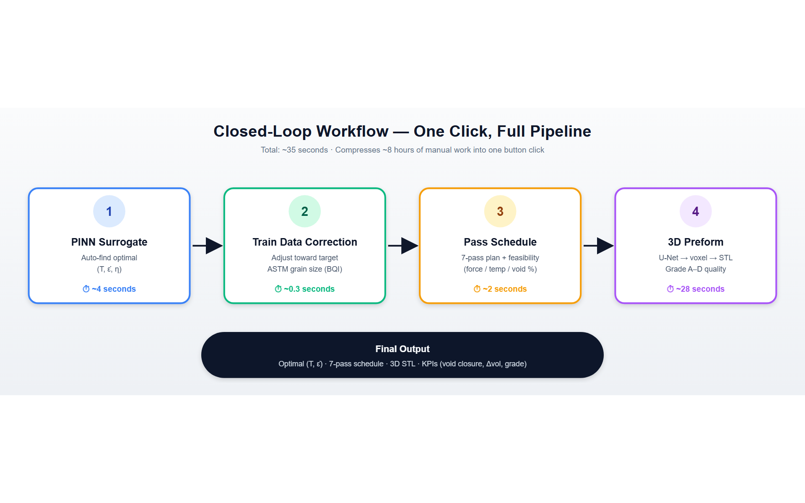
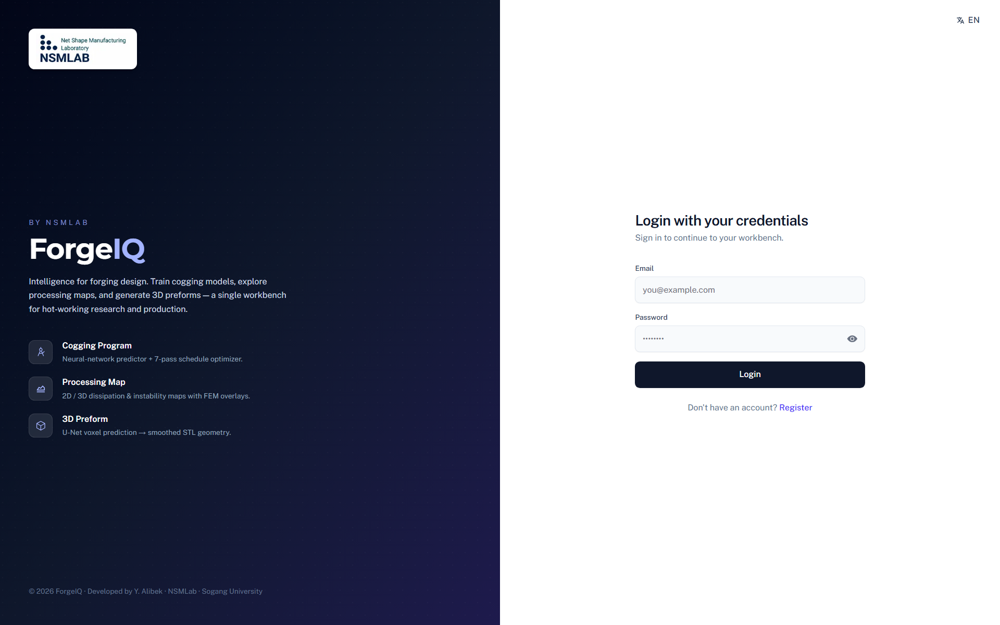
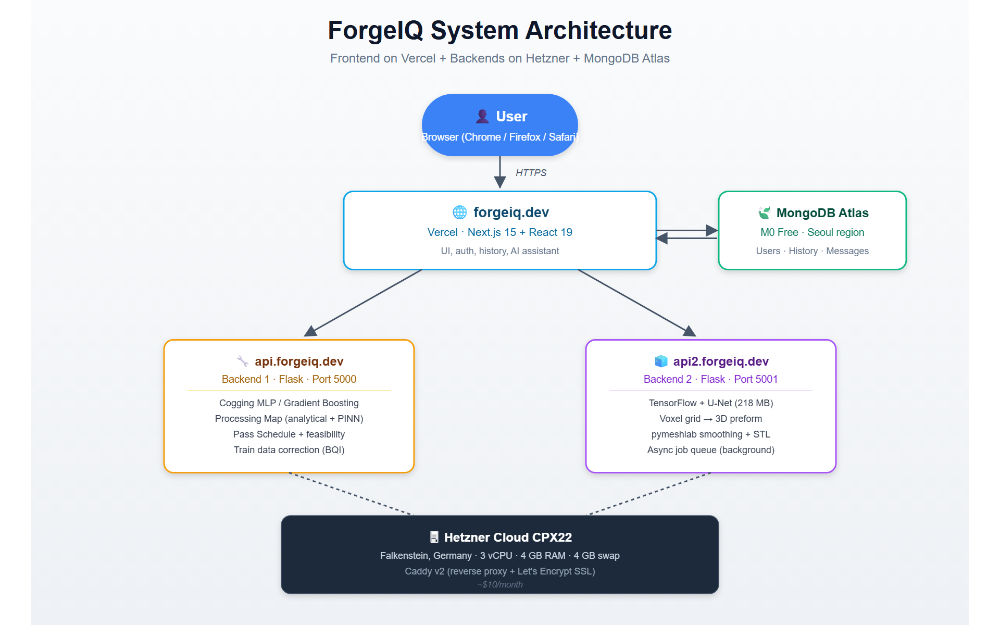
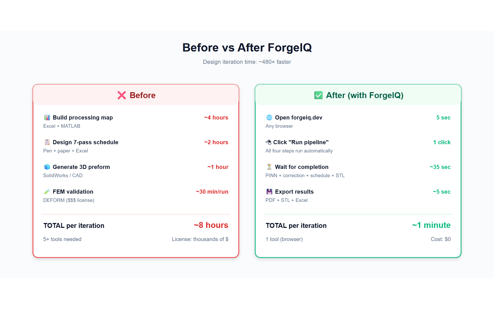
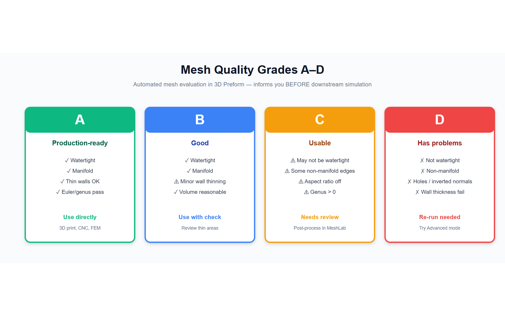
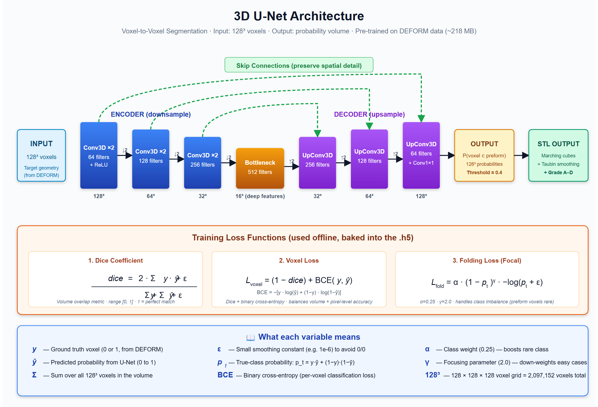

<div align="center">

# ForgeIQ — AI Metallurgy Simulation Platform

**Closed-loop, AI-driven process design for hot-forging and cogging.**
Neural surrogate models + physics-informed networks + 3D preform generation,
delivered as a deployable web platform.

[](https://forgeiq.dev)
[](#release-history)
[](#tech-stack)
[](./LICENSE)
[](#release-history)

[**🌐 Live Demo**](https://forgeiq.dev) ·
[**📺 Demo Video**](#-demo) ·
[**🖼️ Screenshots**](#-screenshots) ·
[**📘 Capabilities**](./CAPABILITIES.md) ·
[**🛣️ Roadmap**](./ROADMAP.md) ·
[**📝 Changelog**](./CHANGELOG.md)

</div>

> [!IMPORTANT]
> **ForgeIQ — AI Metallurgy Simulation Platform** is not affiliated with any other product
> named "ForgeIQ" (CRM, fitness, automation, document analysis, etc.).
> Always reference the full project name in citations and external links.

---

## Why ForgeIQ?

Traditional hot-forging process design takes **weeks** per iteration: build a finite-element
model in DEFORM/QForm, mesh, run, post-process, iterate. ForgeIQ replaces the slow inner loop
with **trained neural surrogates** that return results in **seconds** — so engineers can
explore the design space, validate a pass schedule, and ship a preform STL in one session.

| Without ForgeIQ | With ForgeIQ |
|---|---|
| 1–2 weeks per FEM iteration | **3–60 seconds** per surrogate run |
| Expert-only FEM software | Browser UI, login, share results |
| Manual pass-schedule tuning | Optimizer with equipment-aware feasibility |
| Voxel → STL by hand | One-click Attention-U-Net pipeline |
| No closed loop | **Auto Pipeline** runs all 4 stages end-to-end |

---

## ✨ Key Features

| | Program | What it does |
|---|---|---|
| 🔨 | **Cogging** | MLP / Gradient Boosting surrogate for void closure in open-die forging. Predicts final void volume from ASTM grain size + weight factor + per-pass schedule. |
| 🗺️ | **Processing Map** | Prasad-criterion power-dissipation (`η`) and instability (`ξ`) heatmaps over (T, ε̇). PINN surrogate auto-detects the safe operating window. |
| 📐 | **Pass Schedule** | Equipment-aware pass optimizer. Slab-method force estimate, per-pass force/temperature feasibility check (green/amber/red), 4 material presets (AISI 4340, 1045, Inconel 718, custom). |
| 🧊 | **3D Preform** | Attention-U-Net voxel → STL pipeline. Returns watertight mesh + manufacturability grade A–D (genus, wall thickness, bbox). |
| ⚡ | **Auto Pipeline** | One-click closed loop: PINN → train-data correction → pass schedule → 3D preform. Iteration history, target-driven re-runs. |
| 📊 | **Compare** | Side-by-side: MLP vs Gradient Boosting, Prasad baseline vs PINN surrogate, baseline U-Net vs Attention U-Net. |

Full reference of every formula and every honest limitation: see [CAPABILITIES.md](./CAPABILITIES.md).

---

## 🎬 Demo

> Video walkthrough — full 4-stage Auto Pipeline run, ~90 seconds.

<!-- TODO replace with embedded YouTube/Vimeo link once recorded -->
[](https://forgeiq.dev/workflow)

> **Try it live (no install):** <https://forgeiq.dev> → click **Try Demo** on the landing page.

---

## 🖼️ Screenshots

| Login | Auto Pipeline (Workflow) |
|---|---|
|  |  |

| System architecture | Before / after ForgeIQ |
|---|---|
|  |  |

| Mesh quality grading | U-Net architecture |
|---|---|
|  |  |

> More authenticated screenshots (Cogging, Processing Map, 3D Preform, Compare,
> History, AI Assistant) live in [`assets/screenshots/`](./assets/screenshots/) — see
> the [Screenshot Guide](./assets/SCREENSHOT_GUIDE.md) for the full set.

---

## 🧪 Sample Input / Output

Reproducible sample files ship with the repo under [`sample_data/`](./sample_data/):

| Use case | Input | Output |
|---|---|---|
| **Cogging — quick mode** | `ASTM = 6`, `weight factor = 0.1` (UI form) | Predicted void volume curve + downloadable plot |
| **Cogging — advanced** | [`Cogging data.xlsx`](./sample_data/Cogging%20data.xlsx) | Trained `.h5` model + 4-panel diagnostic image |
| **Processing Map** | [`_RAW_Processing map_AISI4340.xlsx`](./sample_data/_RAW_Processing%20map_AISI4340.xlsx) | 2D / 3D η & ξ contour maps, recommended (T, ε̇) window |
| **3D Preform** | [`Additional_target_node`](./sample_data/) + [`Additional_target_elem`](./sample_data/) (.dat) | Watertight STL (base64) + grade A–D report |
| **Pass Schedule** | [`pretrained_cogging_model.h5`](./sample_data/pretrained_cogging_model.h5) + schedule JSON | Per-pass void closure + feasibility chips |

> Large weights (`unet_model.h5`, voxel `.npy` arrays — together ~720 MB) are **not** committed
> to git. Request them via the contact form on <https://forgeiq.dev> or place them in
> `sample_data/` before running 3D Preform locally.

---

## 🏗️ Architecture


| Service | Tech | Port | Purpose |
|---|---|---|---|
| `frontend` | Next.js 15 + React 19 + TypeScript | **3000** | UI, auth (MongoDB + iron-session), i18n (en / uz / ko), AI assistant |
| `backend1` | Flask + TensorFlow/Keras + scikit-learn + XGBoost | **5000** | Cogging models, processing-map graphs, pass-schedule optimizer |
| `backend2` | Flask + TensorFlow/Keras + numpy-stl + scikit-image + pymeshlab + trimesh | **5001** | Voxel → STL Attention-U-Net pipeline, mesh-quality grading |

Production deployment:
- **Frontend** → Vercel (auto-deploy from `main`)
- **Backends** → Hetzner Cloud CPX22 (Falkenstein, 3 vCPU / 4 GB + 4 GB swap), Caddy → Let's Encrypt
- **DB** → MongoDB Atlas (M0, Seoul region)
- **AI assistant** → Gemini 2.5 Flash (free tier, 1500 req/day)

---

## 🚀 Quick Start

### 1. Windows — one-click launcher (recommended for end users)

```powershell
# Double-click run_first_time.exe (first time only; installs venvs + node_modules + builds frontend, ~15 min)
# Then on every subsequent run, double-click run.exe
```

Browser opens automatically at <http://localhost:3000>.

### 2. Docker — recommended for servers

```bash
cp .env.example .env
# Edit .env — set DB_URI and SESSION_PASSWORD (min 32 chars)

docker compose -f .config/docker-compose.yml --env-file .env up -d --build
# Open http://localhost:3000
```

### 3. Manual / dev start

```bash
# Backend 1
cd backend1 && python -m venv venv && venv\Scripts\activate
pip install -r requirements.txt
waitress-serve --listen=0.0.0.0:5000 main:app

# Backend 2 (separate terminal)
cd backend2 && python -m venv venv && venv\Scripts\activate
pip install -r requirements.txt
waitress-serve --listen=0.0.0.0:5001 main:app

# Frontend (separate terminal)
cd frontend && cp .env.example .env.local
# Edit .env.local — set DB_URI and SESSION_PASSWORD
pnpm install && pnpm dev
```

---

## ⚙️ Configuration

All sensitive values are environment variables. Templates:

- **`/.env.example`** — for Docker (`docker-compose`)
- **`/frontend/.env.example`** — for local Next.js dev

| Variable | Description |
|---|---|
| `DB_URI` | MongoDB connection string |
| `DB_NAME` | DB name (default `forgeiq`) |
| `SESSION_PASSWORD` | **Min 32 chars.** Encrypts iron-session cookies. |
| `NEXT_PUBLIC_BACKEND_URL` | Public URL of backend1 (default `http://localhost:5000`) |
| `NEXT_PUBLIC_BACKEND2_URL` | Public URL of backend2 (default `http://localhost:5001`) |
| `GEMINI_API_KEY` | (optional) AI assistant fallback chain: `gemini-2.5-flash` → `2.0-flash` → `flash-latest` |
| `SMTP_HOST` / `SMTP_USER` / `SMTP_PASS` | (optional) email for welcome / password-reset / admin notification |

Generate a strong `SESSION_PASSWORD` (PowerShell):

```powershell
-join ((33..126) | Get-Random -Count 48 | % {[char]$_})
```

---

## 🧰 Tech Stack

**Frontend** — Next.js 15.4 · React 19 · TypeScript · TailwindCSS · iron-session · Phosphor + Lucide + Tabler icons · three.js (STL viewer) · plotly.js (charts)
**Backend1** — Flask · TensorFlow / Keras · scikit-learn · XGBoost · HistGradientBoostingRegressor (quantile UQ) · openpyxl · matplotlib · waitress
**Backend2** — Flask · TensorFlow / Keras (3D Attention U-Net) · numpy-stl · scikit-image · pymeshlab · trimesh · pyvista · scipy · waitress
**Infrastructure** — Vercel · Hetzner Cloud · Docker Compose · Caddy · MongoDB Atlas · Cloudflare DNS · Let's Encrypt

---

## 🛣️ Roadmap

See [ROADMAP.md](./ROADMAP.md) for the full plan. Highlights:

- **v0.2** — multi-tenancy, organisation accounts, run-history search & sharing
- **v0.3** — extended material library, custom material training UI
- **v0.4** — REST API tokens, batch inference, CLI client
- **v1.0** — production SLA, observability, paid tier

---

## 📚 How to Cite

If you use **ForgeIQ — AI Metallurgy Simulation Platform** in academic work, please cite:

```bibtex
@software{alibek_forgeiq_2026,
  author       = {Y. Alibek},
  title        = {{ForgeIQ}: {AI} Metallurgy Simulation Platform},
  organization = {NSMLab, Sogang University},
  year         = {2026},
  version      = {v0.1.0-beta},
  url          = {https://github.com/jonesh77/forgeiq}
}
```

A machine-readable [`CITATION.cff`](./CITATION.cff) is provided for GitHub's "Cite this repository" button.

---

## 🤝 Contributing & Issues

This is a proprietary project (see [LICENSE](./LICENSE)). External pull requests are not
accepted at this stage, but **bug reports and feature requests are very welcome** —
they help shape the roadmap.

- 🐞 [Open an issue](https://github.com/jonesh77/forgeiq/issues/new/choose) — bug report or feature request template
- 💬 [Contact form on the live site](https://forgeiq.dev) — reaches the author directly
- 📧 alibekyuldoshev96 [at] gmail [dot] com

---

## 🔐 Security

- Passwords stored hashed with **bcrypt** (legacy plaintext auto-upgrades on first login)
- Session cookies encrypted with `SESSION_PASSWORD`; **rotate before production**
- `secure: true` cookies in `NODE_ENV=production`
- Flask `debug` off in production (`FLASK_ENV=production`)
- HTTPS enforced via Caddy + Let's Encrypt; `forgeiq.dev` is on the HSTS preload list

Found a vulnerability? Please email the author privately before public disclosure.

---

## 📦 Release History

| Version | Date | Highlights |
|---|---|---|
| **v0.1.0-beta** | 2026-06-02 | Initial public beta — 4 programs + Auto Pipeline + Compare + full i18n (en / uz / ko) + production deploy on forgeiq.dev |

Full changelog: [CHANGELOG.md](./CHANGELOG.md).

---

## 📄 License

**Proprietary — All Rights Reserved.** © 2026 Y. Alibek (NSMLab, Sogang University).

Source is published for **transparency, review, and academic reference**. Use, copying,
modification, redistribution, or derivative works require **prior written consent** from
the copyright holder. See [LICENSE](./LICENSE) for full terms.

For licensing inquiries (academic collaboration, evaluation, commercial use) — see the
contact info above.

---

<div align="center">

**ForgeIQ — AI Metallurgy Simulation Platform**
Developed by Y. Alibek · NSMLab (Net Shape Manufacturing Laboratory)
[forgeiq.dev](https://forgeiq.dev) · [github.com/jonesh77/forgeiq](https://github.com/jonesh77/forgeiq)

</div>
